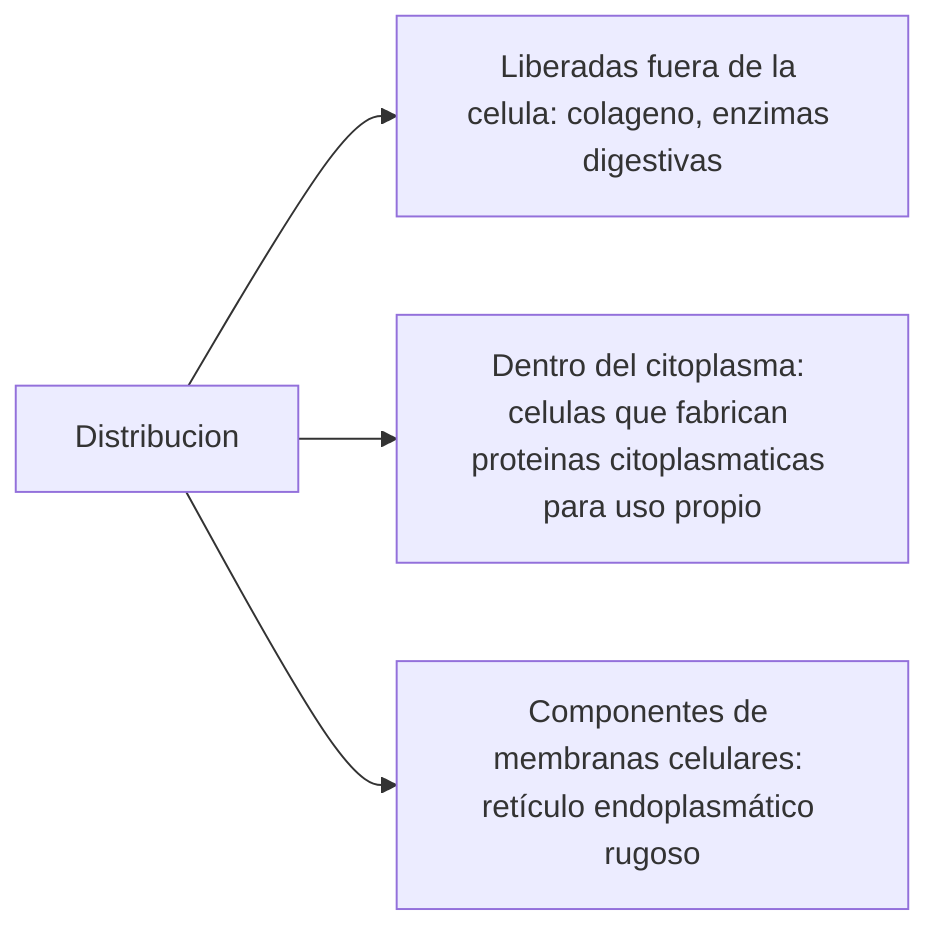
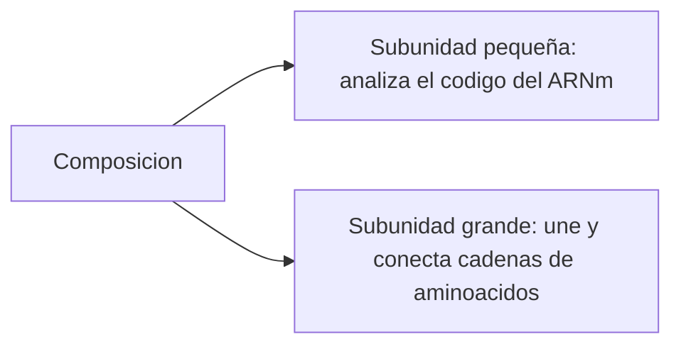
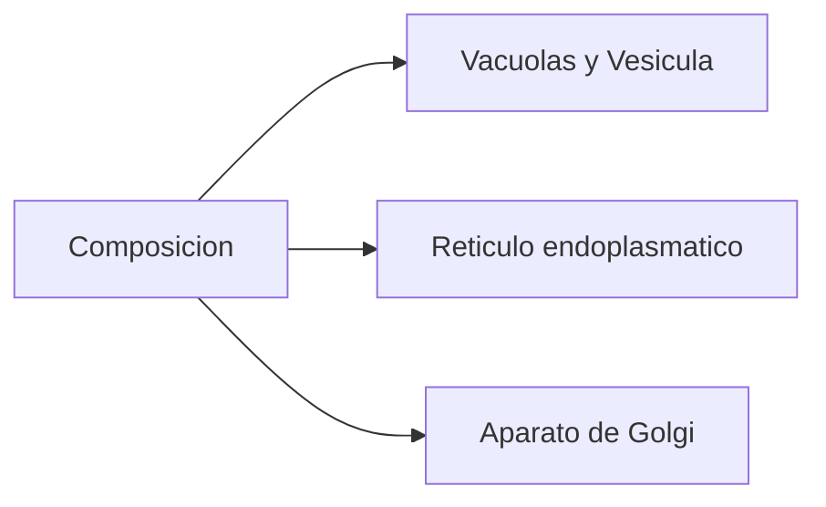
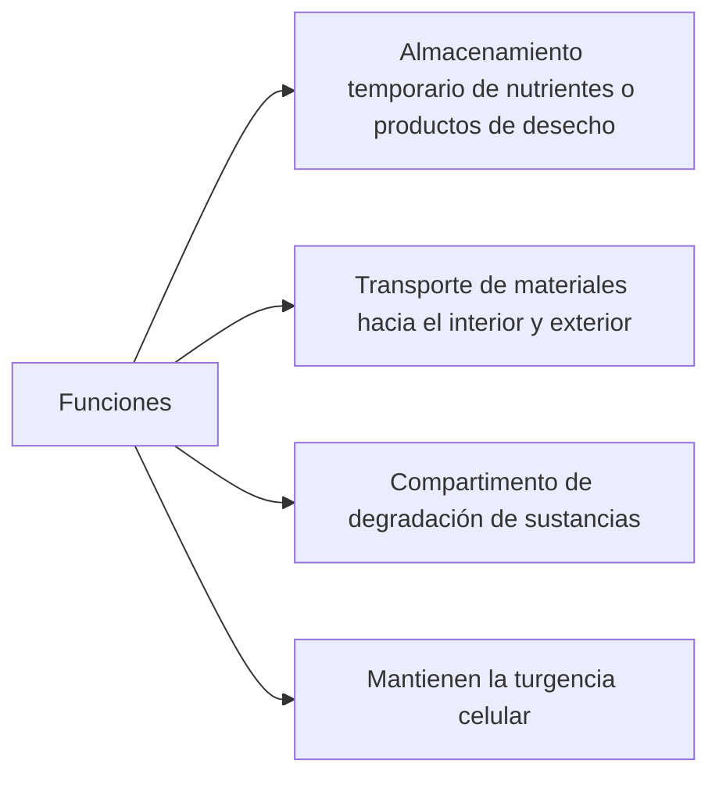
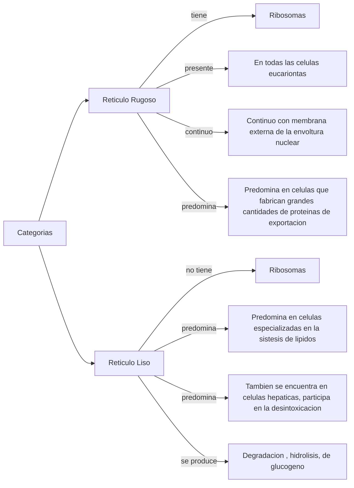

# Biologia - Organizacion Celular

## Membrana Plasmática 
Es una estructura dinámica y fluída formada por *fosfolípidos y proteínas*. 

### Funciones
* Definir límites de la célula. 
* Regula el transito de sustancias hacia dentro y fuera de la celula.

### Bicapa Lipidica

### Caracteristicas 
Suele estar rodeada por un medio acuoso, por esto, las moleculas de *fosfolipidos* se disponen en una **bicapa lipidica**. 

La estructura de la bicapa es fluida, es decir, los lipidos y proteinas unidos a *proteinas periféricas* o *proteinas integrales*, no estan "anclados" a ellas.

Las capas difieren de manera considerable en su composición química (distinto tipo de lípidos, la capa externa es rica en glucolipidos y glucoproteinas). 

### Proteinas Integrales de Membrana
* Orientacion espacial definida
* Las porciones que se extienden a uno u otro lado, son completamente distinta en su *estructura de aminoácidos* y en su *estructura terciaria*. 

### Proteinas Perifericas
* No atraviesan la bicapa
* Se unen a una u otra cara de la membrana mediante interacciones con otras proteinas. 

### Cadena de Carbohidratos

* Las que sobresalen de la cara exterior, unidas a lipidos y proteinas de la membrana, estan implicitas en la adhesion de la celulas entre si y en el reconocimiento de moleculas

### Proteinas
* Catalizar (proceso por el cual se aumenta la velocidad de una **reacción** química) determinadas reacciones químicas (ya que algunas son enzimas)
* *Recepcion, reconocimiento y union* de moléculas señalizadoras del exterior, como hormonas y elementos de la matriz extracelular. 
* Las de *transporte*, se encargan del movimiento de sustancias a traves de la membrana.
* Permiten la adhesion de células entre si y la consecuente formación de tejidos. 

---

## Matriz extracelular (MEC) 
Es el conjunto de materiales extracelulares que forman parte de un *tejido*.

### Composicion
*Proteinas fibrosas* y *carbohidratos* asociados a distintas combinaciones que cumplen *funciones estructurales* ademas de participar en la *adhesion entre células y la matriz*.

### Funciones
* Morfogenesis (proceso biológico que lleva a que un organismo desarrolle su forma)
* Rellenar los espacios entre las células.
* Permitir la compresión y estiramiento de las células.
* Degradar los desechos tóxicos que no necesita nuestro cuerpo para así purificarnos.
* Regeneración de tejidos.

---

## Pared celular (celulas eucariontes y procariontes vegetales)
Es una capa resistente, a veces rígida, porque soporta las fuerzas osmóticas y el crecimiento, que se localiza en el exterior de la membrana plasmática en las células de plantas, hongos, algas, bacterias y arqueas. 

La pared celular protege el contenido de la célula, funciona como mediadora en todas las relaciones de la célula con el entorno y actúa como compartimiento celular. 

Se construye a partir de diversos materiales. En las plantas, se compone principalmente de un polímero de carbohidrato denominado celulosa, un polisacárido, y puede actuar también como almacén de carbohidratos para la célula. 

En las bacterias se compone de peptidoglucano.

### Composicion
Compuesta por una red de *carbohidratos, fosfolípidos y proteínas estructurales* embebidos en una matriz gelatinosa compuesta por otros carbohidratos y proteínas

### Funciones
* Filtro, su estructura porosa deja pasar materiales solubles.
* Conectar celulas entre si, para la formacion de tejidos.
* Transmision de señales que influyen en el crecimiento, division celular y morfogenesis.

--- 
## Nucleo
Orgánulo membranoso el cual se encuentra normalmente en el centro de las células eucariotas. Contiene la mayor parte del material genético celular, organizado en varias moléculas extraordinariamente largas y lineales de ADN, con una gran variedad de proteínas, como las histonas, lo cual conforma lo que llamamos cromosomas. 

El conjunto de genes de esos cromosomas se denomina **genoma nuclear**. La función del núcleo es mantener la integridad de esos genes y controlar las actividades celulares regulando la expresión génica.

### Envoltura celular o Carioteca

### DNA

### Nucleolo

---

## Citoplasma
Parte del **Protoplasma** (interior de la celula) que se encuentra entre el núcleo celular y la membrana plasmática. Consiste en una **dispersión coloidal** muy fina de aspecto granuloso, el **citosol** o hialoplasma, y en una diversidad de **orgánulos celulares** que desempeñan diferentes funciones.

---

## Ribosomas
Estructuras en las que se sintetizan (crean) proteínas ensamblando uno a uno los aminoácidos que los componen (acoplamiento de aminoácidos). 

Dichas proteínas se sintetizan a partir de la información contenida en el ADN, que llega transcrita en forma de ARNm. 

Se originan dentro del núcleo celular (en el nucleolo). Luego se traslada al citoplasma para la creación de proteínas, este proceso recibe el nombre de **traducción**.

No están rodeados por una membrana.

El modo en que se distribuyen en una célula eucarionte, se relaciona con el modo en que se utilizan las proteínas recién sintetizadas.

### Traducción En este proceso de traducción participa una molécula llamada ARN mensajero, el cual es una copia del ADN nuclear. 

1 - Éste, sale del núcleo con la información que le provee el ADN para la fabricación de proteínas. Dicha información determina el orden en que se unirán los aminoácidos. 

2- Una vez en el ribosoma, el ARNm se conecta con el ARN de transferencia, el cual se encarga de transportar los aminoácidos desde el citoplasma al ribosoma y ensamblarlos según la información que contenga el ARNm. 

## Composición
Compuesto por dos sub-unidades, cada una formada por ARN ribosómico y proteínas. 

---

## Sistema de endomembranas

Las celulas eucariontas poseen estructuras que se dividen en compartimentos cada uno con funciones especificas. Estan limitados por **membranas cerradas** que poseen una **permeabilidad selectiva**.

Cada compartimento posee un grupo de **enzimas** que realizan funciones de cada **organela**, y a su vez estan interconectados funcionalmente. 

###Vacuolas y vesiculas - almacenamiento y transporte de materiales
Organelas con forma de bolsas formadas por membranas.

En celulas vegetales, son llamadas **vacuolas**. Son de gran tamaño y están llenas de fluídos (entre un 30% - 90% del tamaño total). A medida que maduran, las numerosas vacuolas se fusionan en una vacuola grande. 

### Reticulo endoplasmatico (celulas eurcariontes)
Red de sacos aplanados, tubos y canales interconectados. 

